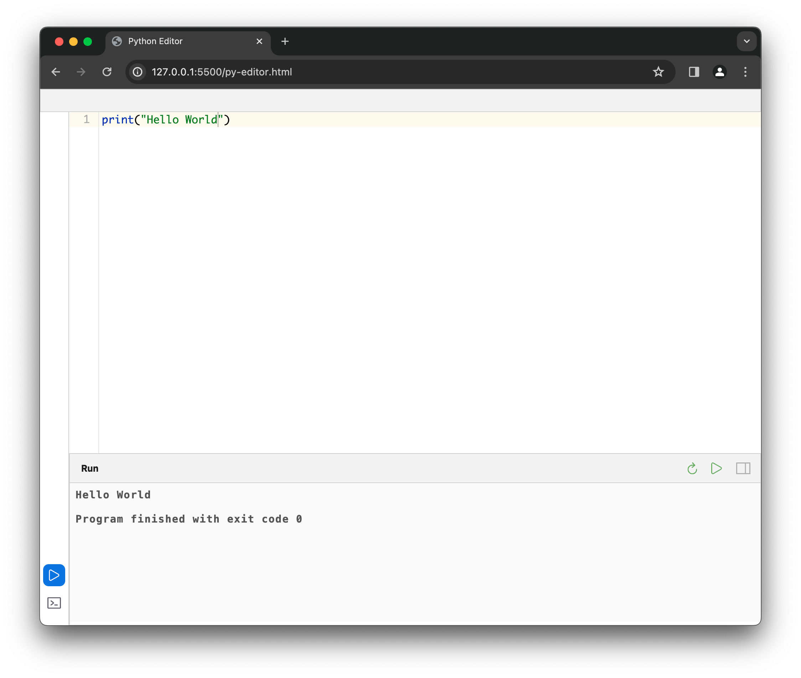

# Online Python Editor

Again, another toy I made.

This editor will not be possible without these opensource projects:
1. [Pyodide](https://pyodide.org/en/stable/)
2. [Ace Editor](https://ace.c9.io)
3. [Xterm.js](https://xtermjs.org)
